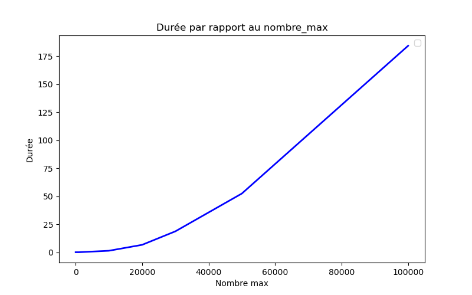
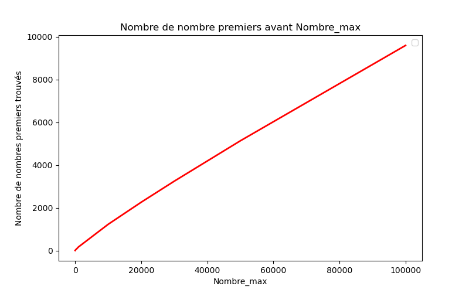
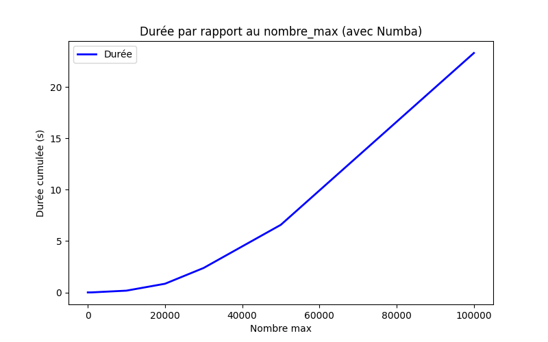

# Primes-numbers
Développement d'un moteur de calcul haute performance (HPC) dédié au dénombrement de nombres premiers sur des plages de données massives.

# Auteur
## Dohemeto Bonaventure K.

-Le projet transpose le crible d'Ératosthène en un environnement distribué en utilisant le framework PETSc et le protocole MPI.

-Points clés :

    Calcul Parallèle : Segmentation de l'espace de recherche via des vecteurs distribués (Vec MPI) pour lever les barrières de mémoire RAM.

    Optimisation HPC : Gestion fine de la localité du cache et réduction des coûts de communication inter-nœuds.

    Analyse de Scalabilité : Étude comparative des performances (Speedup) en fonction du nombre de processeurs.

    Outils : Python/C++, PETSc, MPI, Scibian.


# Introduction
Pour planter le décort, considérons juste un code tout simple permettant de lister les nombres premiers inférieurs ou égales à un nombre fixé. Nous fixerons ce nombre respectivement à 100, 1000, 10000 et 100000 pour nos simulations (de base). 

## Performances sur une machine standard

**Configuration matérielle** :  
- 16 Go RAM  
- AMD Ryzen 7 7730U with Radeon Graphics – 16 CPU ~ 2 GHz  




**Temps d’exécution observé** :

| Nombre maximum | Temps d'exécution |
|----------------|-------------------|
| 10             | ~ 0.000008 s      |
| 100            | ~ 0.000172 s      |
| 1 000          | ~ 0.012303 s      |
| 10 000         | ~ 1.356 s         |
| 20 000         | ~ 5.6 s           |
| 30 000         | ~ 25 s            |
| 50 000         | ~ 51 s            |
| 100 000        | ~ 179 s           |

Dès que l’on atteint 100 000, le temps de calcul devient plus important. L'idéal est de pouvoir simuler pour des nombres vraiment grands.  
**Ce constat justifie pleinement l’utilisation d’une approche HPC parallèle et distribuée.**


---
```python
import numpy as np
import time
import matplotlib.pyplot as plt

debut = time.time()
#nombre_max = 50000
liste_temps =  [10, 100, 1000, 10000, 20000, 30000, 50000]

def diviseurs(n):
    divs = []
    for i in range(1, n + 1):
        if n % i == 0:
            divs.append(i)
    return divs

liste_valeur = []
liste_nombre = []
for nombre_max in liste_temps:
    prime_list = []
    for k in range(2,nombre_max + 1):
        j = diviseurs(k)     
        if len(j) == 2:
            prime_list.append(k)
    end = time.time()
    temps = end - debut
    liste_valeur.append(temps)
    print(f"Les nombres premiers inférieurs ou égales à {nombre_max} sont: {prime_list}")       

    print(f"Il y a {len(prime_list)} nombres premiers inférieurs ou égales à {nombre_max}.\n")    
    liste_nombre.append(len(prime_list))
    print(f"Temps total: {temps}")

plt.figure(figsize=(8, 5))
plt.plot(liste_temps, liste_valeur, "b-", linewidth=2)
plt.xlabel("Nombre max")
plt.ylabel("Durée")
plt.legend()
plt.title("Durée par rapport au nombre_max")
plt.show()

plt.figure(figsize=(8, 5))
plt.plot(liste_temps, liste_nombre, "r-", linewidth=2)
plt.xlabel("Nombre_max")
plt.ylabel("Nombre de nombres premiers trouvés")
plt.legend()
plt.title("Nombre de nombre premiers avant Nombre_max")
plt.show()


```
---

## Architecture du projet (à venir)

- Utilisation de Numba:  un compilateur JIT (Just‑In‑Time) pour Python, spécialement conçu pour accélérer les calculs numériques.
- Partitionnement de l’intervalle de recherche en sous‑domaines.
- Distribution sur plusieurs nœuds via MPI.
- Implémentation du crible d’Ératosthène avec PETSc (vecteurs distribués).
- Réduction et rassemblement des résultats.
- Analyse de speedup et d’efficacité.


## Déroulement 
## Utilisation de Numba

Pour améliorer les performances, nous avons utilisé **Numba**, un compilateur *Just‑In‑Time* permettant d’optimiser les boucles Python et d’obtenir des vitesses proches du C.

Pour cette première version, on peut souligner l'utilisation d'une forme non vectorisé du code (avec la présence d'une boucle for à l'intérieur d'une autre). Une version vectorisée sera utilisée dans la suite de notre présentation.

### Temps d’exécution observé (version Numba)

| Nombre maximum | Temps d'exécution |
|----------------|-------------------|
| 10             | ~ -----      |
| 100            | ~ -----      |
| 1 000          | ~ 0.002 s      |
| 10 000         | ~ 0.171 s      |
| 20 000         | ~ 0,844 s       |
| 30 000         | ~ 2.38 s       |
| 50 000         | ~ 6,584 s       |
| 100 000        | ~ 23,318 s       |


### Analyse

L’accélération est beaucoup plus élevée : plusieurs ordres de grandeur plus rapide que la version Python naïve.  
Cependant, même avec Numba, la complexité algorithmique finit par dominer pour des bornes très grandes.
Par exemple pour 1 000 000 , on constate une lenteur atroce de l'algorithme.

➡️ Ce qui nous pousse à explorer d'autres approches.

---
```python
import numpy as np
import time
import matplotlib.pyplot as plt
from numba import njit

@njit
def trouver_premiers_numba(n_max):
    """Retourne la liste des nombres premiers <= n_max (algorithme d'origine)"""
    premiers = []
    for n in range(2, n_max + 1):
        nb_div = 0
        for i in range(1, n + 1):
            if n % i == 0:
                nb_div += 1
        if nb_div == 2:          
            premiers.append(n)
    return premiers


liste_temps = [10, 100, 1000, 10000, 20000, 30000, 50000, 100000]

liste_valeur = []     # temps cumulés
liste_nombre = []     # nombres de premiers trouvés

# Appel "à vide" pour forcer la compilation Numba avant la première mesure
trouver_premiers_numba(10)

debut = time.time()  

for nombre_max in liste_temps:
    prime_list = trouver_premiers_numba(nombre_max)

    end = time.time()
    temps = end - debut
    liste_valeur.append(temps)

    print(f"Les nombres premiers inférieurs ou égales à {nombre_max} sont: {prime_list}")
    print(f"Il y a {len(prime_list)} nombres premiers inférieurs ou égales à {nombre_max}.\n")
    liste_nombre.append(len(prime_list))
    print(f"Temps cumulé: {temps:.3f} s")


plt.figure(figsize=(8, 5))
plt.plot(liste_temps, liste_valeur, "b-", linewidth=2)
plt.xlabel("Nombre max")
plt.ylabel("Durée cumulée (s)")
plt.legend(["Durée"])
plt.title("Durée par rapport au nombre_max (avec Numba)")
plt.show()

plt.figure(figsize=(8, 5))
plt.plot(liste_temps, liste_nombre, "r-", linewidth=2)
plt.xlabel("Nombre_max")
plt.ylabel("Nombre de nombres premiers trouvés")
plt.legend(["Quantité"])
plt.title("Nombre de nombres premiers avant Nombre_max")
plt.show()
```
---
## Partitionnement de l’intervalle de recherche en sous‑domaines

Pour passer à l’échelle, nous découpons l’intervalle `[2, N_max]` en **sous‑intervalles disjoints** confiés chacun à un processus MPI différent. Chaque processus applique un **crible segmenté** sur son bloc, en utilisant la liste des petits premiers (≤ √N_max) qui est diffusée à tous.

### Stratégie de découpage

Soit `P` le nombre de processus. Le nombre total d’entiers à traiter est `N_max - 1`.  
Un découpage par blocs contigus (dit *block distribution*) est utilisé :

- Taille de base : `base = (N_max - 1) // P`
- Reste : `reste = (N_max - 1) % P`

Les `reste` premiers processus reçoivent un élément supplémentaire.  
Pour un processus de rang `r` :

```python
---
```python
#!/usr/bin/env python3
from mpi4py import MPI
import math
import time
import sys

def petits_premiers(limit):
    """Retourne la liste des nombres premiers <= limit (crible simple)."""
    sieve = [True] * (limit + 1)
    sieve[0:2] = [False, False]
    for i in range(2, int(limit**0.5) + 1):
        if sieve[i]:
            step = i
            start = i * i
            sieve[start:limit+1:step] = [False] * ((limit - start)//step + 1)
    return [i for i, is_p in enumerate(sieve) if is_p]

def crible_segmente(debut, fin, petits):
    """Crible sur [debut, fin] (inclus) avec la liste des petits premiers."""
    taille = fin - debut + 1
    est_premier = [True] * taille
    for p in petits:
        # Premier multiple de p dans l'intervalle
        start = max(p * p, ((debut + p - 1) // p) * p)
        for multiple in range(start, fin + 1, p):
            est_premier[multiple - debut] = False
    return [debut + i for i, flag in enumerate(est_premier) if flag]

def main():
    comm = MPI.COMM_WORLD
    rank = comm.Get_rank()
    size = comm.Get_size()

    N = 1_000_000
    if len(sys.argv) > 1:
        N = int(sys.argv[1])

    # --- Partitionnement ---
    total = N - 1
    base = total // size
    reste = total % size

    if rank < reste:
        debut = 2 + rank * (base + 1)
        fin = debut + base
    else:
        debut = 2 + rank * base + reste
        fin = debut + base - 1

    # --- Petits premiers (communs à tous) ---
    rootN = int(math.isqrt(N))
    petits = petits_premiers(rootN)

    # --- Calcul local ---
    start_time = time.time()
    premiers_locaux = crible_segmente(debut, fin, petits)
    end_time = time.time()
    temps_local = end_time - start_time

    # --- Rassemblement des résultats ---
    tous_les_premiers = comm.gather(premiers_locaux, root=0)
    temps_max = comm.reduce(temps_local, op=MPI.MAX, root=0)

    if rank == 0:
        resultat = []
        for bloc in tous_les_premiers:
            resultat.extend(bloc)
        print(f"N = {N} : {len(resultat)} nombres premiers")
        print(f"Temps maximal sur un processus : {temps_max:.3f} s")
        if len(resultat) >= 10:
            print("Derniers premiers :", resultat[-10:])

if __name__ == "__main__":
    main()
    
```
---
# Résultats expérimentaux

Les tests ont été réalisés sur :

- AMD Ryzen 7 7730U
- 16 Go de RAM
- Python 3 + mpi4py
- Implémentation du crible segmenté

## Résultats obtenus

| Nombre maximum | Nombre de nombres premiers | Temps maximal |
|----------------|---------------------------|---------------|
| 10 000         | 1 229                     | ~0.000 s       |
| 100 000        | 9 592                     | 0.019 s       |
| 1 000 000      | 78 498                    | 0.187 s       |
| 10 000 000     | 664 579                   | 2.040 s       |
| 100 000 000    | 5 761 455                 | 23.092 s      |

## Exemples de sorties

### N = 10 000

```text
N = 10000 : 1229 nombres premiers
Temps maximal sur un processus : 0.0000000000 s
Derniers premiers :
[9887, 9901, 9907, 9923, 9929, 9931, 9941, 9949, 9967, 9973]
```

### N = 100 000

```text
N = 100000 : 9592 nombres premiers
Temps maximal sur un processus : 0.0190010071 s
Derniers premiers :
[99877, 99881, 99901, 99907, 99923, 99929, 99961, 99971, 99989, 99991]
```

### N = 1 000 000

```text
N = 1000000 : 78498 nombres premiers
Temps maximal sur un processus : 0.1865553856 s
Derniers premiers :
[999863, 999883, 999907, 999917, 999931, 999953, 999959, 999961, 999979, 999983]
```

### N = 10 000 000

```text
N = 10000000 : 664579 nombres premiers
Temps maximal sur un processus : 2.0395517349 s
Derniers premiers :
[9999889, 9999901, 9999907, 9999929, 9999931, 9999937, 9999943, 9999971, 9999973, 9999991]
```

### N = 100 000 000

```text
N = 100000000 : 5761455 nombres premiers
Temps maximal sur un processus : 23.0915534496 s
Derniers premiers :
[99999787, 99999821, 99999827, 99999839, 99999847,
99999931, 99999941, 99999959, 99999971, 99999989]
```

## Analyse

L'utilisation du crible segmenté change radicalement les performances du calcul :

| Méthode | Temps pour N = 100 000 |
|----------|----------------------|
| Python naïf | ~179 s |
| Python + Numba | ~23 s |
| Crible segmenté | ~0.019 s |

On observe une amélioration de plusieurs ordres de grandeur par rapport à l'approche initiale basée sur les tests de divisibilité.

L'algorithme permet désormais de traiter :

- 1 million d'entiers en moins de 0.2 seconde ;
- 10 millions d'entiers en environ 2 secondes ;
- 100 millions d'entiers en environ 23 secondes.

Ces résultats valident l'intérêt du crible segmenté comme base pour une future version HPC distribuée utilisant MPI et PETSc.
